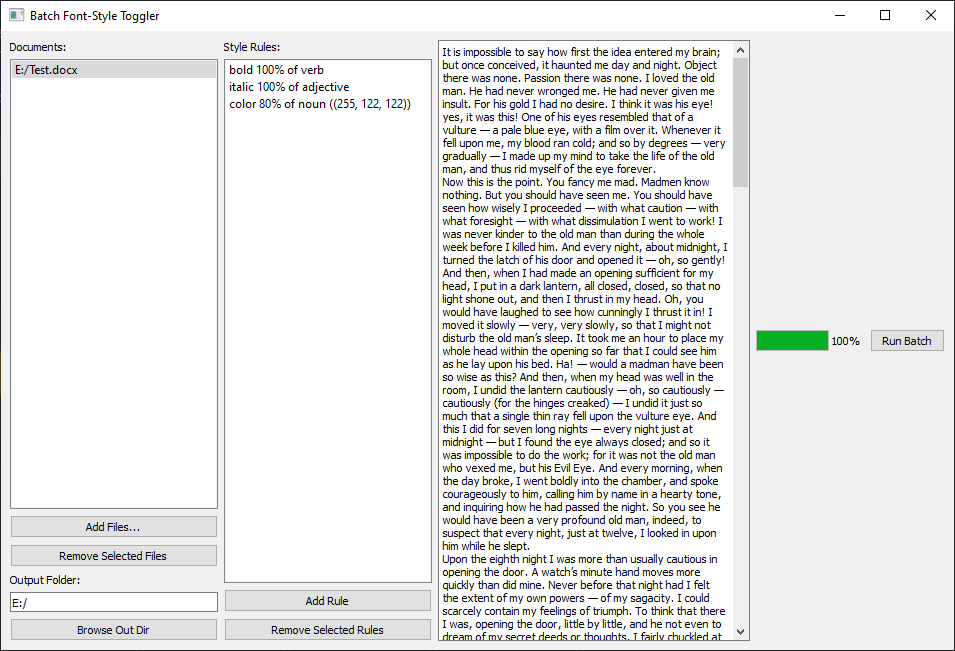

## Batch Font-Style Toggler v2.0

A PyQt5 desktop application for batch styling Word (`.docx`) and Markdown (`.md`) documents using NLP-driven rules.

### Features

* **Batch Processing**: Apply style rules to multiple files at once.
* **Style Rules**: Define rules targeting headings, verbs, nouns, adjectives, and adverbs.
* **Rich Styling**: Bold, italic, underline, strikethrough, uppercase transformation, and custom RGB color.
* **Preview Pane**: Quick plain-text preview of selected documents.
* **Background Worker**: Non-blocking processing with a progress bar.





### Requirements

* Python 3.8+
* `PyQt5`
* `python-docx`
* `spacy` (with the `en_core_web_sm` model)

Install dependencies:

```bash
pip install PyQt5 python-docx spacy
python -m spacy download en_core_web_sm
```

### Installation

1. Clone this repository
2. Ensure dependencies are installed (see above).

### Usage

1. **Add Files**: Click **Add Files...** and select `.docx` or `.md` documents.
2. **Define Rules**: Click **Add Rule** and configure your style rule.
3. **Choose Output**: Set the **Output Folder**.
4. **Run Batch**: Click **Run Batch** and watch the progress bar.
5. **Review**: Styled files will appear in the output folder with `_styled` suffix.

